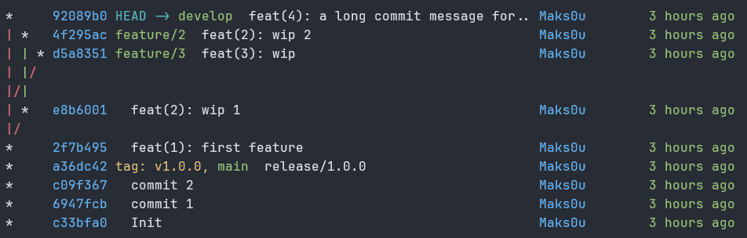
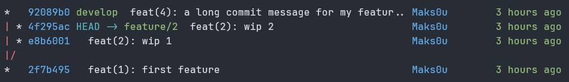

# git-graph

An out-of-the-box pretty `git log --graph`.



## Features

- **Lightweight**: Only depends on standard Unix tools.
- **Smart defaults**: Colorful, readable graph — no configuration needed.
- **Flexible**: Use (almost) any `git log` option.
- **Autocompletion**: Uses `git log` completions.

## Requirements

- Git
- Awk
- Cat
- tput

## Installation

### Oh My Zsh

1. Clone the repository into your oh-my-zsh custom plugins directory:

```zsh
git clone "https://github.com/Maks0u/git-graph.git" "${ZSH_CUSTOM:-~/.oh-my-zsh/custom}/plugins/git-graph"
```

2. Add `git-graph` to your list of plugins in your `.zshrc` file:

```zsh
plugins=(... git-graph ...)
```

### Manual install

```bash
curl --location https://raw.githubusercontent.com/Maks0u/git-graph/refs/heads/main/git-graph.sh --output /usr/local/bin/git-graph
chmod +x /usr/local/bin/git-graph
```

You'll have to manually define aliases:

```bash
alias gg='git-graph'
alias gga='git-graph --all'
alias ggs='git-graph --all --max-count=20 | cat'
```

## Usage

| Alias | Description                                                               |
| ----- | ------------------------------------------------------------------------- |
| gg    | Show a graph of the current branch.                                       |
| gga   | Show a graph of all branches.                                             |
| ggs   | Print the last 20 commits across all branches.                            |
| ggb   | Visualize last common commit of diverging branches using `git merge-base` |

### Examples

#### Print the last 100 commits across all branches

```zsh
gga --max-count=100 | cat
```

#### Visualize merge-base of HEAD and develop branch

```zsh
ggb develop HEAD
```



#### Use (almost) any `git log` option

```zsh
gga --since='1 month' --date-order
```

```zsh
gga -S 'secret'
```

## Roadmap

- [ ] Add customization capabilities (width, columns, etc.)

## License

[MIT](LICENSE)

## Inspirations

- [Git Graph](https://marketplace.visualstudio.com/items?itemName=mhutchie.git-graph) extension for Visual Studio Code
- [Pretty Git branch graphs](https://stackoverflow.com/questions/1057564/pretty-git-branch-graphs) (stack overflow)
