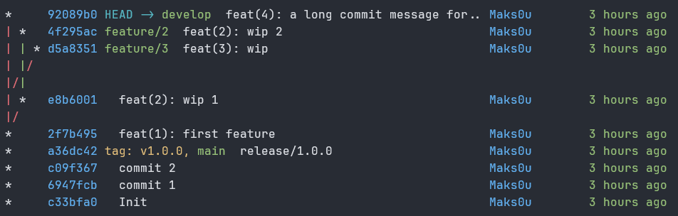
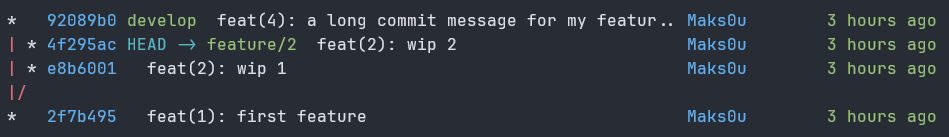

# git-graph

An out-of-the-box pretty `git log --graph`.



## Features

- **Lightweight**: Only depends on standard Unix tools.
- **Smart defaults**: Colorful, readable graph — no configuration needed.
- **Flexible**: Use (almost) any `git log` option.
- **Autocompletion**: Uses `git log` completions.

## Requirements

- Git
- Awk
- Cat
- tput (optional)

## Usage

```bash
git-graph
```

```bash
gg
```

| Alias | Description                                                               |
| ----- | ------------------------------------------------------------------------- |
| gg    | Show a graph of the current branch.                                       |
| gga   | Show a graph of all branches.                                             |
| ggs   | Print the last 20 commits across all branches.                            |
| ggb   | Visualize last common commit of diverging branches using `git merge-base` |

### Examples

#### Print the last 100 commits across all branches

```zsh
gga --max-count=100 | cat
```

#### Visualize merge-base of HEAD and develop branch

```zsh
ggb develop HEAD
# Or
ggb develop
# Or
export GIT_GRAPH_DEFAULT_BRANCH=develop
ggb
```



#### Custom date format

```bash
# ISO date format
GIT_GRAPH_DATE_WIDTH=25 git-graph --date=iso
# Or
export GIT_GRAPH_DATE_FORMAT=iso
export GIT_GRAPH_DATE_WIDTH=25
git-graph
```

```bash
# Custom date format
GIT_GRAPH_DATE_WIDTH=16 git-graph --date='format:%Y-%m-%d %H:%M'
# Or
export GIT_GRAPH_DATE_FORMAT='format:%Y-%m-%d %H:%M'
export GIT_GRAPH_DATE_WIDTH=16
git-graph
```

#### Use (almost) any `git log` option

```zsh
gga --since='1 month' --date-order
```

```zsh
gga -G 'secret'
```

```zsh
gg --stat
```

### Configuration

Customize the output using the following environment variables.

| Environment variable              | Description                                                                                                       | Type   | Default value        |
| --------------------------------- | ----------------------------------------------------------------------------------------------------------------- | ------ | -------------------- |
| `GIT_GRAPH_WIDTH`                 | Overall output width                                                                                              | number | Computed with `tput` |
| `GIT_GRAPH_AUTHOR_WIDTH`          | Width for the "author" column                                                                                     | number | 12                   |
| `GIT_GRAPH_DATE_WIDTH`            | Width for the "date" column                                                                                       | number | 12                   |
| `GIT_GRAPH_DATE_FORMAT`           | Date format using [git's `--date` syntax](https://git-scm.com/docs/pretty-formats).                               | string | relative             |
| `GIT_GRAPH_DEFAULT_BRANCH`        | Default ref used when calling `git-graph-merge-base` (or `ggb`) with no argument.                                 | string | main                 |
| `GIT_GRAPH_GRAPH_WIDTH_THRESHOLD` | Threshold for removing left indentation. Prevents breaking columns layout when using `--stat` or similar options. | number | 30                   |

## Installation

### Oh My Zsh

1. Clone the repository into your oh-my-zsh custom plugins directory:

```zsh
git clone "https://github.com/Maks0u/git-graph.git" "${ZSH_CUSTOM:-~/.oh-my-zsh/custom}/plugins/git-graph"
```

2. Add `git-graph` to your list of plugins in your `.zshrc` file:

```zsh
plugins=(... git-graph ...)
```

### [Antidote](https://github.com/mattmc3/antidote) plugin manager

```bash
antidote install Maks0u/git-graph
```

Or simply add `Maks0u/git-graph` to your `.zsh_plugins.txt` file.

### Manual install

You can use the script on its own without installing it as a zsh plugin.

```bash
curl --location https://raw.githubusercontent.com/Maks0u/git-graph/refs/heads/main/git-graph.sh --output /usr/local/bin/git-graph
chmod +x /usr/local/bin/git-graph
```

You'll have to manually define aliases:

```bash
alias gg='git-graph'
alias gga='git-graph --all'
alias ggs='git-graph --all --max-count=20 | cat'
```

## Roadmap

- [x] Use `HEAD` as default when providing a single argument to `ggb`
- [ ] Column customization
	- [x] Column widths
	- [ ] Toggle columns
- [x] Date format customization
- [ ] Two lines format
- [x] Fix format when using `--stat`, `--compact-summary`, etc.

## License

[MIT](LICENSE)

## Inspirations

- [Git Graph](https://marketplace.visualstudio.com/items?itemName=mhutchie.git-graph) extension for Visual Studio Code
- [Pretty Git branch graphs](https://stackoverflow.com/questions/1057564/pretty-git-branch-graphs) (stack overflow)
